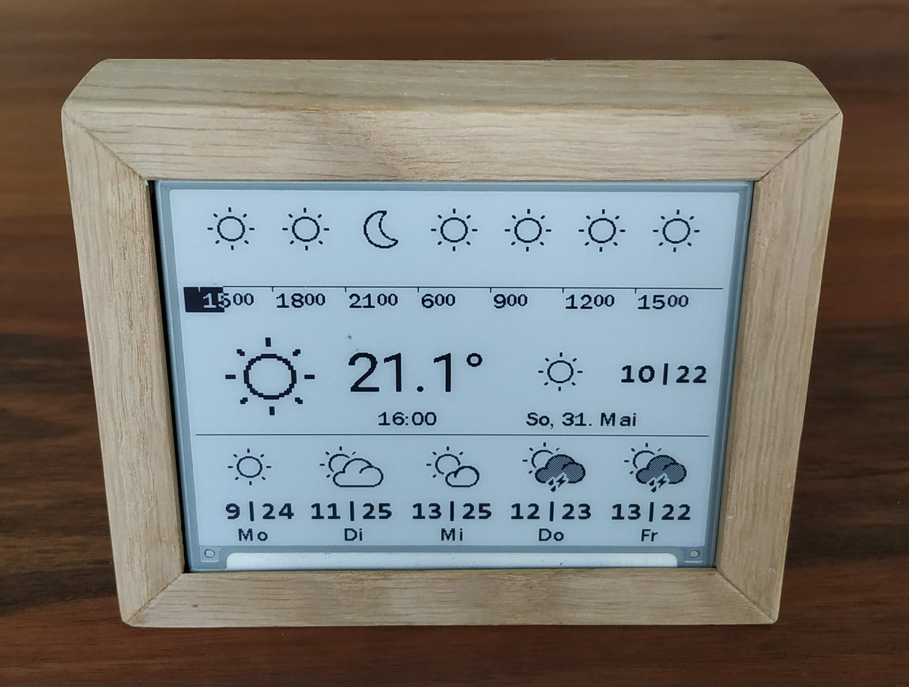
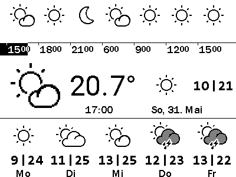

# Weather Station ESP 32 + Waveshare 4.2" e-Paper Module

## Introduction
This is the source code for a small personal project and can be used to create a weather station using an esp-32 and an e-paper display.

**WARNING:** This project will not run without heavy modifications

**Most importantly, you will need to provide your own API access to a local weather service.**

When not using an ESP-32 board or Waveshare 4.2" e-Paper display, major modifications of the code will be necessary (drivers and display dimensions). 

## Getting Started

### Prerequisites
Connect the display to the board according to the links in the resources section. Make sure that the demo applications work and display the images correctly.

Setup the project in [PlatformIO](https://platformio.org/platformio-ide).

### Installation
1. Copy and rename `include/wifi_login.h.example` to `include/wifi_login.h` and change SSID, password to your local Wifi network.
2. Build and upload the program. Without providing a server for the local weather service API, the program will use a sample response found in [resources/sample_response.json](resources/sample_response.json) and display it.

### Modification
1. Provide server and headers for the request to your local weather service API.
2. Currently the API response is parsed in [src/weather.cpp](src/weather.cpp). This will have to be changed for different data formats.

### Graphics
Icons and fonts can be found in [resources/](resources/). [convert.py](resources/convert.py) can be used to convert images into byte arrays usable in [data.h](include/data.h):
- `python convert.py image icons/bolt_1.png` to output code for the specific icon
- `python convert.py font fonts/consolas.png "|m.-0123456789"` to create a font definition
- `python convert.py preview -height 300 demo.bin` to preview any byte array

## Resources
| Component | Links |
| - | - |
| Waveshare 4.2" e-Paper Module | https://www.waveshare.com/wiki/4.2inch_e-Paper_Module https://www.waveshare.com/w/upload/2/20/4.2inch-e-paper-module-user-manual-en.pdf |